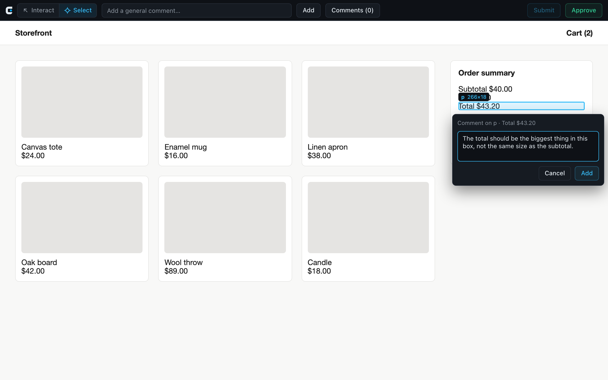
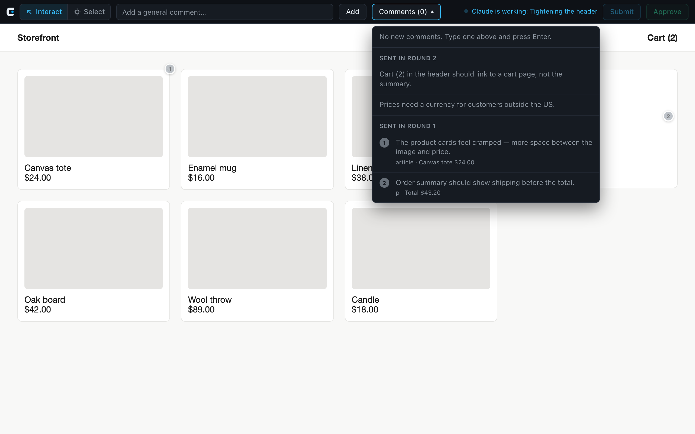

<h1>
  <picture>
    <source media="(prefers-color-scheme: dark)" srcset="assets/gloss-glyph-dark.svg">
    
  </picture>
  Gloss
</h1>




Review a running web app in a browser with a feedback bar across the top, and
hand what you wrote to Claude.

`gloss open <url>` opens the page in a Chromium window with the Gloss bar over
it. The reviewer writes comments in the bar and presses **Submit** to send
them to Claude as a round. Claude applies them and the window reloads with its
summary of what changed. This repeats until the reviewer presses **Approve**.

Gloss never fixes anything itself. It is the channel between the reviewer and
whatever runs Claude (Claude Code, or Reeve). The agent drives the session
with four short commands: `gloss wait` for the reviewer's verdict, `gloss
working` and `gloss ready` either side of its changes, and `gloss close`. The
Claude Code plugin in this repo runs that loop for you.

## Install

With Homebrew:

```sh
brew install ryanbrunner/tap/gloss
gloss install-chromium            # once: about 150 MB
```

`gloss install-chromium` downloads the Chromium that Gloss's own Playwright
drives, so the browser always matches it. On Linux it also needs system
libraries that the download does not include; `gloss install-chromium` says
so rather than installing them unasked. Run `gloss install-chromium
--with-deps` to get those too (it asks for sudo).

### From a checkout

Node 22.12 or later.

```sh
npm install
node bin/gloss.js install-chromium   # once: about 150 MB
npm link                             # optional: puts `gloss` on your PATH
```

Without `npm link`, run it as `node bin/gloss.js …` or `npm run gloss -- …`.

### The Claude Code plugin

The repo is a Claude Code plugin marketplace. With `gloss` on your PATH:

```
/plugin marketplace add ryanbrunner/gloss
/plugin install gloss@gloss
```

From a checkout, `/plugin marketplace add /path/to/gloss` works too.

Then `/gloss http://localhost:3000` opens the page and loops: it waits for
your round, marks itself working, applies the comments, says it is ready
with a summary, and waits again, until you approve.

## Commands

```
gloss open <url> [--name N]    show <url> in the Gloss window, starting a session if there is none
gloss status [--name N] [--json]   exit 0 and say where the session is and its phase, or exit 1 if there is none
gloss close [--name N]         end the session and close its window
gloss install-chromium [--with-deps]   download the Chromium Gloss drives, once
gloss --version                print Gloss's version

gloss wait [--name N]          block until the reviewer submits or approves; print the verdict as JSON
gloss working [message]        the bar says Claude is working, with the message; the reviewer cannot submit
gloss ready [summary]          reload the window, show the summary, and hand the next round to the reviewer
```

`gloss wait` prints one JSON document on stdout and nothing else, described
in [docs/verdict.md](docs/verdict.md). **Only exit 0 with `"approved": true`
is approval.** Exit 1 with nothing on stdout means no verdict: no session, or
the window was closed or the session ended while it waited. Asked again
before `working` or `ready`, it prints the same round, so after a round the
next command is `gloss working`, not `gloss wait`.

A round goes: the reviewer submits (**submitted**), the agent runs `gloss
working` (**working**), then `gloss ready` (back to **reviewing**, one round
on). Approve ends it (**approved**).

`gloss open` returns as soon as the window is up (within 15 seconds) and
prints the session's address. Run it again from the same directory and it
moves the same window to the new URL. Closing the window ends the session too.

There is one session per working directory. `--name` gives a directory more
than one.

### Where things live

- `~/.gloss/sessions/<id>.json`: the running session's pid, port and token.
  The id is a hash of the directory and `--name`. It is outside the repo, so
  a session never dirties a worktree.
- `~/.gloss/logs/<id>.log`: the session process's output.

Set `GLOSS_HOME` to move both.

### The session API

The session serves a small HTTP API on `127.0.0.1` only. Every request needs
the token from the state file:

```sh
state=~/.gloss/sessions/<id>.json
curl -H "Authorization: Bearer $(jq -r .token $state)" \
  "http://127.0.0.1:$(jq -r .port $state)/api/state"
```

| Route | |
| --- | --- |
| `GET /api/health` | `{ok, pid, url}`: the page the window is on now |
| `GET /api/state` | `{round, phase, message, summary, comments: [{id, body, createdAt, page, sentIn, pin?}]}` |
| `GET /api/verdict?wait=N` | the verdict, or `{pending: true}` after N seconds (at most 30); 409 while working, 410 once the session is ending |
| `POST /api/working` | `{message}`: the agent has the round |
| `POST /api/ready` | `{summary}`: the agent is done; reloads every page |
| `POST /api/navigate` | `{url}`: move the window |
| `POST /api/close` | end the session |

`round` is the round being written now. `phase` is `reviewing`, `submitted`,
`working` or `approved`. A comment's `sentIn` is the round it went out in, or
`null` while it is unsent. A pinned comment's `pin` has the element's `selector`,
`tag`, `text`, `box` and the `viewport`, the path of its `screenshot`, and
`quote`, when it was made on a selection.

## The bar

- Type a comment and press Enter or Add. Shift+Enter adds a new line.
- **Interact** and **Select**, beside the round, are the tools. In Interact
  the page works as usual. In Select, the page's links and buttons do nothing:
  the element under the pointer is outlined, with its tag and size, and a
  click opens a comment box beside it, headed with the element's tag and text.
  Enter or **Add** pins the comment to the element; the session keeps a
  selector for it and a screenshot of it, taken with the outline and markers
  hidden. Select stays on after Add or **Cancel**, for the next element, until
  you press Escape (which closes an open box first) or Interact. On a phone
  the tools are one crosshair button that turns Select on and off. They are
  disabled once the review is approved.
- In Interact, selecting text on the page offers a **Comment on selection**
  button beside it; the comment it starts is pinned the same way, with the
  selected words kept alongside it as a quote.
- Each pinned comment gets a numbered marker on its element's top right
  corner, which follows it as the page scrolls; hover it to see the comment
  and outline the element. The list shows the same number with the element's
  tag and text. A marker for an unsent comment stays where the element was if
  its selector stops finding it. Once a round is sent, its markers are dimmed,
  and shown only where the selector still finds a visible element.
- **Comments (n)** counts the comments not yet sent. The list shows those
  first, each with a delete button, then every earlier round under "Sent in
  round N", dimmed and read-only, so you can check what was asked.
- **Submit** sends the unsent comments as a round. It is disabled when there
  is nothing new, and while the round is with Claude.
- **Approve** ends the review. With unsent comments, it asks first, in the
  bar: "Approve and discard N unsent comments?" **Discard & approve** deletes
  them for good (they never reach Claude, and there is no undo); **Cancel**
  leaves everything as it was.
- The status beside the buttons says where the round is: "Sent round N,
  waiting for Claude", "Claude is working: …", Claude's summary once it is
  ready, or "Approved". On a phone it sits in a line under the bar.
- Comments belong to the session, not the page, so they survive a reload and
  every tab shows the same list.
- The bar lives in a shadow root on one `<gloss-bar>` element on `<html>`. Page
  CSS cannot reach into it and its CSS cannot leak out. The changes to the
  page's own styles are `html { margin-top: 44px }`, which pushes the page down
  below the bar, and 44px added to the page's own `scroll-padding-top`, so an
  anchor jump lands below the bar and any sticky header the page allows for.
  Fixed and sticky elements placed from the top of the viewport, such as a
  header, are moved down by the same 44px. And since `100vh` still measures
  the whole window, each `vh` length in the page's stylesheets is shortened
  to match: `100vh` becomes `calc(100vh - 44px)`, so a full-height layout
  ends at the bottom of the window rather than 44px past it.
- The page under review is the code Claude is editing, so it must not be able
  to approve. The bar's script runs in an isolated world: it shares the
  page's DOM but none of its JavaScript, and only that world can reach the
  session. Nothing the page patches (`JSON`, `Map`, `Promise`, a prototype)
  is on the path a call takes. Submit, Approve and a comment's page link act
  only on trusted clicks, so the page clicking them through the shadow root
  does nothing, and the session refuses changes from frames and from pages
  that are not http or https. `scripts/spikes/loop-check.ts` tries each of
  these from the page.

### Known gaps

- A `vh` length the bar cannot rewrite still overflows by 44px: one in an
  inline `style` attribute (including a `--vh` the page sets from
  `innerHeight`), a cross-origin stylesheet, the page's own adopted or
  shadow-root sheets, or a rule inserted into a sheet after it loaded, as
  CSS-in-JS libraries do in production. `vmin`, `vmax` and `min-height`
  media queries still measure the whole window.
- A fixed or sticky element inside a web component's shadow root is not
  moved, and sits under the bar.
- An element inside a web component's shadow root is pinned as the
  component itself.
- A pin's selector is the path to the element when it was picked
  (`#summary > p:nth-of-type(3)`). After the agent's changes it may find a
  different element, and a sent pin's dimmed marker then sits on that one.
- The window is Chrome for Testing, not your own browser: it has no profile,
  logins or extensions.
- `document.execCommand` edits whatever has focus, including the comment box,
  and in Chromium fires only a trusted `input` event with no `beforeinput`
  first, unlike a real edit. `createValueGuard` in `src/bar/dom.ts` marks a
  trusted edit as the box's own on its `beforeinput`, after every page
  capture listener further up the tree has had its turn, and bar.ts stops
  `beforeinput` and `input` from bubbling past the shadow root, so a page
  bubble listener cannot run in the gap before the matching `input` either.
  What checks that `input` is on `window`, in the capture phase and
  registered before the page's own scripts run, so it is still the first to
  see one fired from inside a page's own capture listener's `execCommand`,
  nested in the real edit's dispatch. It puts the box's `value` back
  whenever an `input` arrives on a box not expecting one, so the page cannot
  rewrite the comment the reviewer is about to send. A page task already
  queued when a `beforeinput` gets no `input` at all - backspace in an empty
  box - could still land in the small gap before the fallback clears that
  box's flag. It cannot stop a page that writes `value` straight through
  the shadow root, which is still open; that wants the root closed.

## Why Playwright, not a proxy or an iframe

To pin comments to elements, the bar needs to reach the page's DOM.
A cross-origin iframe can't do that, and `X-Frame-Options` or a CSP can refuse
framing altogether. That leaves two choices: a proxy that injects the bar
into the HTML it serves, or a browser that injects it for us. Gloss drives
Chromium with Playwright, and gives every page the bar over DevTools: a
script run on each new document, in an isolated world, and a binding only
that world can call:

- **The page is untouched.** It loads from its real origin. A proxy would
  have to decompress and rewrite HTML and absolute URLs, relay the dev
  server's HMR websocket, strip CSP and frame headers, and keep cookies and
  redirects from escaping to the real origin.
- **A strict CSP doesn't stop it.** The script runs whatever the page's CSP
  says. The bar's styles are constructed stylesheets rather than `<style>`
  tags, and it talks to the session through the binding rather than
  `fetch`, so neither `style-src` nor `connect-src` gets in the way.
- **It follows you.** New tabs, client-side navigation and full reloads all
  get the bar again.
- **HTTPS dev hosts load**, with `ignoreHTTPSErrors`, as in Reeve's screenshots.

The cost is the Chromium download and a window that isn't your everyday
browser. If Chromium is missing, `gloss open` exits 1 and says to run
`gloss install-chromium`.

## Development

```sh
npm test              # unit tests
npm run typecheck
npm run dev -- -port 4400
npm run schema        # rewrite schema/verdict.v1.json from src/verdict.ts
npx tsx scripts/spikes/open-check.ts   # end to end, headless; needs Chromium
npx tsx scripts/spikes/loop-check.ts   # the review loop: rounds, working, ready, approve, no-verdict cases
npx tsx scripts/spikes/nav-check.ts    # links, forms, client nav, X-Frame-Options: DENY
```

CI runs all three spikes on every push and pull request, in
`.github/workflows/ci.yml`. It also installs the packed tarball the way
Homebrew does and runs it on node 22 and 26, and lints the formula.
[docs/releasing.md](docs/releasing.md) covers releases.

`npm run dev` serves a fixture storefront to point `gloss open` at. It also
reads `--port` and `PORT`. Query flags make each state of the bar reachable
by URL, using the same bar with its comments kept in the page. `&pins=N` pins
the first N comments, sent ones first, and `&pick=N` picks the Nth of the
same elements; both take numbers, since a selector's `#` would end the query:

| URL | |
| --- | --- |
| `/` | the storefront, no bar |
| `/?gloss` | the bar, empty |
| `/?gloss&seed=2&list` | two comments, with the list open |
| `/?gloss&sent=3&seed=1&list` | three comments sent over two rounds, one new |
| `/?gloss&phase=submitted&sent=2` | round 1 sent, waiting for Claude |
| `/?gloss&phase=working&msg=…` | Claude working, with its message |
| `/?gloss&summary=…&sent=2` | back with the reviewer, showing Claude's summary |
| `/?gloss&seed=2&confirm` | the discard-and-approve prompt |
| `/?gloss&phase=approved&sent=2` | approved |
| `/?gloss&select` | Select mode, nothing picked |
| `/?gloss&select&pick=2` | Select mode, commenting on the order total |
| `/?gloss&seed=3&pins=3` | three comments pinned to storefront elements, with markers |
| `/?gloss&sent=2&seed=1&pins=3` | two sent pins, dimmed, beside a new one |
| `/?fixed` | a `position: fixed` header |
| `/?fullheight` | an app shell sized to `100vh`, the shop scrolling inside it |
| `/?csp` | served with a strict Content-Security-Policy |

Two environment variables exist for the spike: `GLOSS_HEADLESS=1` runs the
session's Chromium headless, and `GLOSS_CDP_PORT` opens a DevTools port on it
so the spike can look inside the window.
